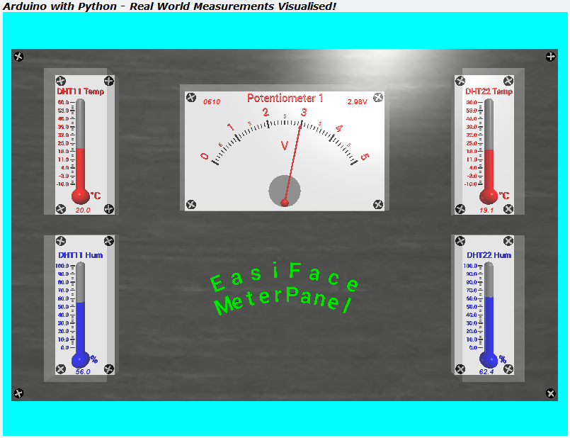

# TTB-AP-Lesson7
My Solution to Paul McWhorter's "Arduino with Python: LESSON 7" homework.

Visit Paul's video here:
 - https://youtu.be/watch?v=kF6biceKwFY

You can get Paul's code here:
 - https://toptechboy.com/using-an-arduino-with-python-lesson-7-measuring-temperature-and-humidity-with-the-dht11/

You can see my solution demonstrated here:
 - Part A - https://youtu.be/dWHmZ2d8M5w
 - Part B - https://youtu.be/8y3apH-z4aY

My Arduino sketch has some "poor man" multitasking with "millis()" and the Python code is now functional and classy!

## My EasiFace Meter Panel:

